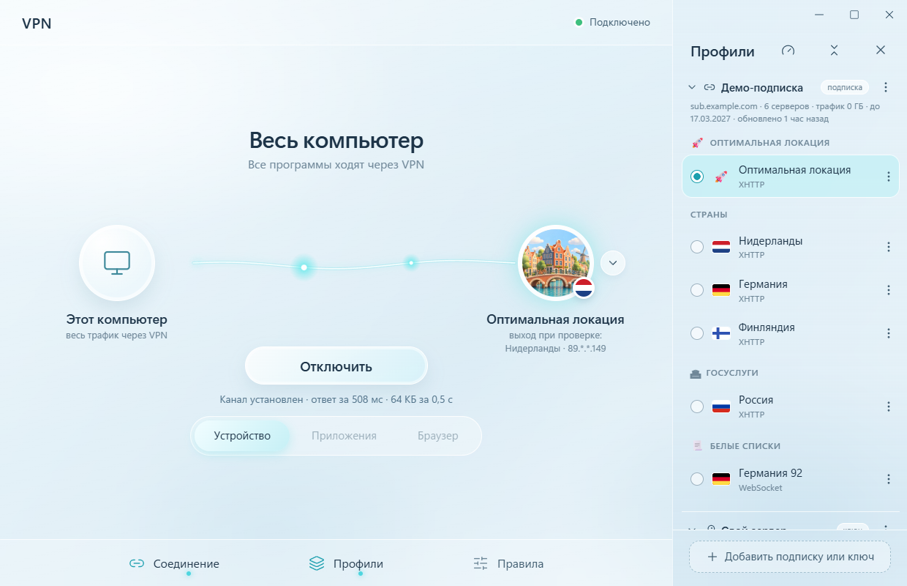
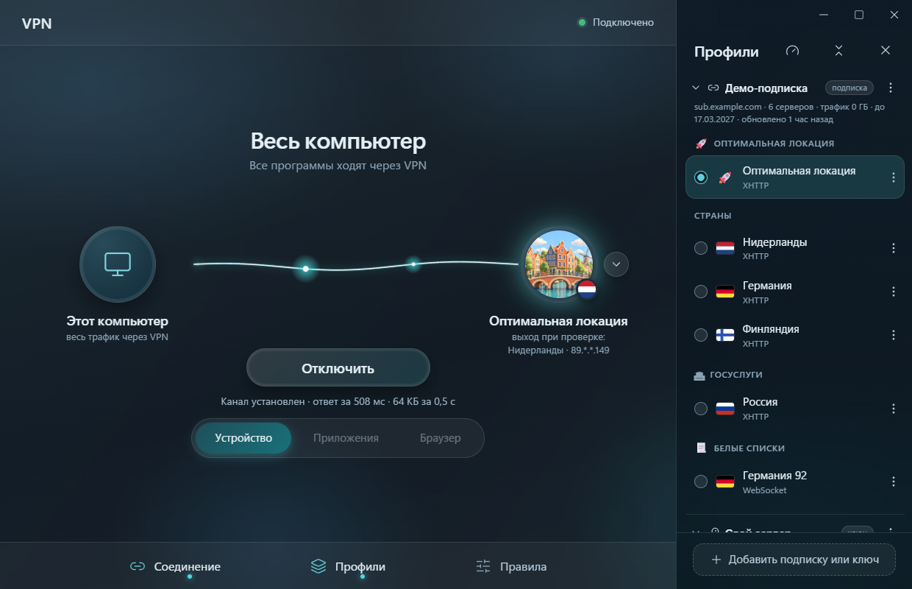
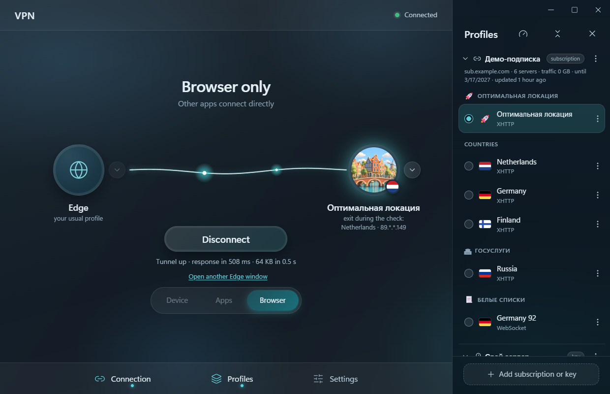

# ninja-vpn

**Бесплатный VPN-клиент для Windows с открытым кодом.** Стеклянное окно, маленькая ниндзя, которая несёт ваши данные по нити к серверу, и три режима: весь компьютер, выбранные программы или только браузер.

*[English below](#english)*

  
  

> Программу придумал и вёл **KOM**, а написана она вместе с **Claude Opus 5.5** (Anthropic) в Claude Code — от первой строки мотора до тёмной темы.

## Скачать

**[Последний выпуск — установщик `ninja-vpn_…_x64-setup.exe`](https://github.com/Kom129/ninja-vpn/releases/latest)**

- Windows 10 или 11, 64 бита. Ставится для текущего пользователя, права администратора для установки не нужны.
- Установщик не подписан сертификатом, поэтому Windows может показать «Windows защитила ваш компьютер» — нажмите **«Подробнее» → «Выполнить в любом случае»**. Контрольная сумма SHA-256 — на странице выпуска.

## Важно

**ninja-vpn — это клиент, серверов в нём нет.** Нужна своя подписка или ключ `vless://` от VPN-сервиса или собственного сервера. Пользуйтесь им по законам своей страны.

## Что умеет

- **Три режима**
  - **Устройство** — весь компьютер через VPN (TUN). При каждом подключении Windows спрашивает разрешение администратора.
  - **Приложения** — «только эти программы через VPN» (Discord, Telegram, VS Code, приложения из Microsoft Store…) или «все, кроме этих». Сторож показывает, идут ли соединения программы через VPN.
  - **Браузер** — ваш обычный Chrome, Edge, Яндекс Браузер или Brave со всеми закладками и паролями. Если он уже открыт, программа предложит перезапустить его через VPN — вкладки вернутся.
- **Подписки и ключи VLESS**: TCP, WebSocket, gRPC, HTTPUpgrade, HTTP/2, XHTTP; защита TLS или REALITY (+Vision). Небезопасные ключи (без TLS/REALITY или без проверки сертификата) программа не принимает.
- **Честное «Подключено»**: зелёный свет загорается только после того, как данные правда прошли через сервер.
- **Скорость всех серверов** одной кнопкой, **резерв** (если сервер не ответил — пробует похожий), **переподключение** при обрыве.
- **Смена страны на лету** — выбрали другую в «Профилях», и программа переключилась сама, без «Отключить».
- **Другой VPN**: если включён ещё один VPN на весь компьютер, программа предупредит и не даст им сломать интернет друг другу.
- **Ключ с телефона по QR-коду:** ключ пришёл на телефон — наведите камеру на QR-код в программе, вставьте ключ на открывшейся странице, и он появится на компьютере. Только по вашему Wi-Fi, без чужих серверов; страница защищена одноразовым секретом и живёт, пока открыто окно.
- **Светлая и тёмная тема**, «как в Windows».
- **7 языков**: русский, English, Español, Português, Türkçe, 中文, فارسی (справа налево).

## Как пользоваться

1. «Профили» → **«+ Добавить подписку или ключ»** → вставьте ссылку. Ключ на телефоне? Нажмите **«С телефона по QR-коду»** и отсканируйте код.
2. Выберите сервер (кнопка со спидометром проверит скорость всех).
3. Выберите режим внизу и нажмите **«Подключить»**.

## Конфиденциальность

- Подписки и ключи хранятся только на вашем компьютере, зашифрованными средствами Windows (DPAPI), в `%APPDATA%\com.ninjavpn.app`.
- Никакой статистики и аналитики. Сама программа обращается только к адресу вашей подписки, к вашим VPN-серверам и — уже через VPN — к сайтам проверки связи: страна выхода — `cloudflare.com/cdn-cgi/trace` и `ipinfo.io`, «сайт открывается» — `google.com/generate_204`, пробная загрузка 64 КБ — `speed.cloudflare.com`, `fsn1-speed.hetzner.com` или `cachefly.net`.
- В режиме «Устройство» DNS-запросы компьютера идут через VPN к Cloudflare (`1.1.1.1`, DNS over HTTPS).

## Сборка из исходников

Коротко: Rust + Node.js, `scripts\fetch-engines.ps1`, потом `cd app && npm install && npm run tauri build`. Подробно — в [docs/DEVELOPMENT.md](docs/DEVELOPMENT.md).

## На чём построено

| Компонент | Лицензия | Исходный код |
|---|---|---|
| [sing-box](https://github.com/SagerNet/sing-box) 1.14.2 — сетевое ядро (входит в установщик) | GPL-3.0-or-later | [v1.14.2](https://github.com/SagerNet/sing-box/tree/v1.14.2) |
| [Xray-core](https://github.com/XTLS/Xray-core) 26.3.27 — ядро для XHTTP (входит в установщик) | MPL-2.0 | [v26.3.27](https://github.com/XTLS/Xray-core/tree/v26.3.27) |
| [Tauri](https://tauri.app) 2, [React](https://react.dev) | MIT / Apache-2.0 | — |
| [country-flag-icons](https://www.npmjs.com/package/country-flag-icons), [lucide](https://lucide.dev) | MIT, ISC | — |

Картинки ниндзя, стран и иконка сгенерированы с помощью OpenAI через Codex, подробно — в [ASSETS.md](ASSETS.md).

## Лицензия

[GPL-3.0](LICENSE). Пользуйтесь, меняйте и делитесь свободно; если распространяете изменённую версию — откройте и её код. Программа поставляется «как есть», без гарантий.

---

## English

**A free, open-source VPN client for Windows.** A frosted-glass window, a little ninja carrying your data along a thread to the server, and three modes: the whole computer, selected apps, or just the browser.

> Conceived and led by **KOM**, written together with **Claude Opus 5.5** (Anthropic) in Claude Code.

**[Download the latest release](https://github.com/Kom129/ninja-vpn/releases/latest)** — Windows 10/11 x64, per-user install. The installer is not code-signed, so SmartScreen may warn you: click **More info → Run anyway**. The SHA-256 checksum is on the release page.

**ninja-vpn is a client only — it has no servers.** You need your own subscription or `vless://` key from a VPN service or your own server. Use it in accordance with your local laws.

**Features:** Device mode (whole PC via TUN), Apps mode (only these apps / all except these, with a live “is it really going through the VPN” watcher), Browser mode (your usual Chrome/Edge/Yandex/Brave profile with bookmarks and passwords); VLESS over TCP, WebSocket, gRPC, HTTPUpgrade, HTTP/2 and XHTTP with TLS or REALITY; an honest “Connected” only after data actually went through the server; speed test of all servers, fallback servers, auto-reconnect, switching servers on the fly; sending a key from your phone by scanning a QR code (over your Wi-Fi only, protected by a one-time secret); a warning if another whole-PC VPN is on; light and dark themes; 7 languages.

**Privacy:** subscriptions and keys stay on your PC, encrypted with Windows DPAPI. No telemetry. The app only talks to your subscription URL, your VPN servers and — through the VPN — connectivity-check sites (Cloudflare and `ipinfo.io` for the exit country, Google `generate_204`, a 64 KB test download from Cloudflare, Hetzner or CacheFly). In Device mode DNS goes through the VPN to Cloudflare `1.1.1.1` (DoH).

**Building:** see [docs/DEVELOPMENT.md](docs/DEVELOPMENT.md) (in Russian; commands are universal).

**License:** [GPL-3.0](LICENSE). Bundled: sing-box (GPL-3.0-or-later, [source](https://github.com/SagerNet/sing-box/tree/v1.14.2)), Xray-core (MPL-2.0, [source](https://github.com/XTLS/Xray-core/tree/v26.3.27)).
