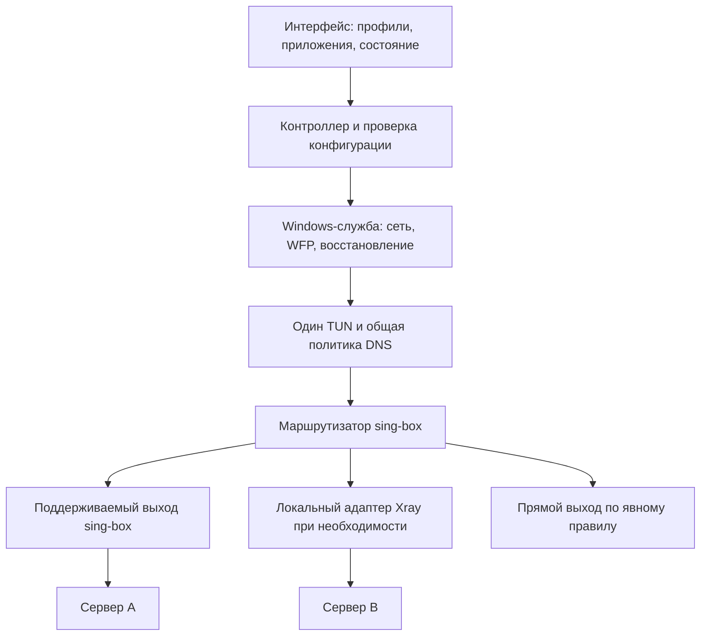

# VPN-клиент для России и Windows: исследование и рекомендуемая архитектура

**Срез источников: 3 октября 2026 года.** Задача: современный расширяемый клиент с VLESS и другими протоколами, режимами «весь компьютер», «выбранные приложения», «только браузер», несколькими профилями и автоматическим восстановлением.

Это исследование первичных источников и инженерное предложение. Подключения через российских операторов, тестирование VPN-серверов и измерения скорости в рамках этой работы не выполнялись. Дата проверки документации не равна дате измерений цензуры: они указаны отдельно. Ниже нет рейтинга «работает у всех» — собранных данных для такого утверждения недостаточно.

## 1. Решение для нашего приложения

Я рекомендую строить клиент вокруг **независимой модели профилей, одного владельца маршрутизации и нескольких заменяемых сетевых адаптеров**. Устойчивость обеспечивают доступные резервные серверы, разные способы передачи, корректный DNS и восстановление после отказа.

Для заявленного многопротокольного продукта основной кандидат — **sing-box для TUN, DNS и маршрутов**, с **Xray как дополнительным исполнителем профилей, которым нужны его возможности**, прежде всего XHTTP и отдельные расширения VLESS. Xray не должен создавать второй конкурирующий TUN. Возможность нескольких ядер закладывается в архитектуру, но дополнительные процессы запускаются только по необходимости.

Первый технический прототип следует сделать с одним ядром: VLESS + REALITY и Hysteria 2 в sing-box, полный туннель, базовый DNS и аварийная блокировка. Затем проверить XHTTP через адаптер Xray. Это предложение по порядку разработки, а не результат сравнения производительности ядер. Если продукт сознательно сузить до VLESS/REALITY/XHTTP, один Xray с его собственным TUN тоже является разумным вариантом.

Протоколы начального набора: **VLESS + RAW/TCP + REALITY + Vision**, **VLESS + XHTTP + TLS/HTTP2**, **Hysteria 2**. **NaiveProxy по HTTP/2** — приоритетный дополнительный TCP-путь. **AmneziaWG** — отдельный последующий модуль. Остальные протоколы добавляются по потребности пользователей и совместимости их серверов.

## 2. Что известно о блокировках

| Наблюдение | Что действительно подтверждено | Следствие для клиента |
|---|---|---|
| DNS и TLS/SNI | OONI описывает DNS-подмену и сбои после ClientHello при блокировке OONI Explorer с сентября 2024 года | Смена DNS не решает все виды блокировки; проверять DNS, TCP и TLS отдельно |
| Фильтрация по адресу и протоколу | Исследование TSPU 2022 года выявило различные триггеры, включая IP, SNI и QUIC | Нужны разные серверные адреса и TCP/UDP-пути; исторические параметры нельзя считать неизменными |
| Соединение есть, передачи нет | Cloudflare в июне 2025 года описала сбросы и ограничения передачи, согласующиеся с первыми примерно 16 КБ данных | Проверка соединения должна включать полезную передачу после handshake |
| Различия по времени и сетям | OONI фиксирует рост аномалий Telegram в марте 2026 года на большой совокупности измерений | Работоспособность одного приложения/сайта не доказывает работоспособность остальных |
| Разрешённые сервисы при ограничениях мобильной сети | Билайн официально объявил такую модель в сентябре 2025 года и поддерживает соответствующую страницу | Для внешнего VPN-сервера может отсутствовать разрешённый путь; одна маскировка этого не гарантирует |

Источники: [OONI, блокировка Explorer](https://ooni.org/post/2024-russia-blocked-ooni-explorer/), [Censored Planet, TSPU, IMC 2022](https://censoredplanet.org/assets/tspu-imc22.pdf), [Cloudflare, отчёт от 26 июня 2025](https://blog.cloudflare.com/russian-internet-users-are-unable-to-access-the-open-internet/), [OONI, Telegram, март 2026](https://explorer.ooni.org/findings/2026-russia-blocked-telegram), [Билайн, запуск 5 сентября 2025](https://khmao.beeline.ru/customers/press/news/details/zapuskaem-belie-spiski/), [текущая страница Билайн](https://moskva.beeline.ru/whitelist-unlock/).

Есть и более узкие технические наблюдения: в апреле 2026 года разработчики Snowflake разбирали захват пакетов и признаки фильтрации DTLS. Это полезное свидетельство зависимости доступности от реализации handshake, но не доказательство идентичного механизма для VLESS или QUIC во всей России. [Первичный разбор Snowflake](https://github.com/net4people/bbs/issues/603).

Исследователи также демонстрировали распознавание OpenVPN с активными проверками и классификацию прокси по характеристикам вложенных TLS-соединений. Такие работы обосновывают модель угроз, но не подтверждают внедрение конкретного классификатора каждым российским оператором. [USENIX 2022, OpenVPN fingerprinting](https://www.usenix.org/conference/usenixsecurity22/presentation/xue-diwen), [USENIX 2024, encapsulated TLS](https://www.usenix.org/conference/usenixsecurity24/presentation/xue-fingerprinting).

Практическая граница: ошибка timeout может означать блокировку, потерю связи, перегрузку или отказ сервера. В интерфейсе следует писать «сервер не отвечает» или «передача прерывается», если причина не установлена. OONI специально разграничивает аномалии и подтверждённую блокировку. [Методология OONI](https://ooni.org/support/interpreting-ooni-data/).

## 3. Протокол, транспорт и защита — разные параметры

В нашем профиле следует хранить отдельно:

- **Протокол:** например VLESS, Trojan или Hysteria 2.
- **Транспорт:** например RAW/TCP, XHTTP по HTTP/2 или QUIC.
- **Защиту:** TLS, REALITY либо поддерживаемое расширение шифрования.
- **Сервер:** адрес, порт, ключи, имя TLS, возможности TCP/UDP и DNS.
- **Режим устройства:** TUN или локальный прокси; он не является свойством удалённого протокола.

VLESS, REALITY и XHTTP нельзя представлять как три взаимоисключающих пункта. Обычный VLESS с `encryption=none` нуждается в защищённом внешнем канале; современный Xray также документирует отдельное **VLESS Encryption**. Поэтому импорт должен проверять конкретные параметры, а не только префикс `vless://`. [Транспортные слои Xray](https://xtls.github.io/en/config/transport.html), [VLESS outbound](https://xtls.github.io/en/config/outbounds/vless.html).

UDP приложения и UDP между клиентом и сервером — разные вещи. Например, отдельные профили переносят UDP приложения внутри TCP. Это сохраняет возможность работы некоторых UDP-приложений при ограниченном внешнем UDP, но добавляет задержки и зависимость от потерь TCP. Обратное тоже верно: TCP браузера может ехать внутри QUIC/UDP-туннеля и перестать работать при блокировке внешнего UDP.

## 4. Сравнение вариантов

Таблица описывает назначение, а не измеренный рейтинг российских операторов. Во всех строках требуется достижимый сервер с совместимой конфигурацией.

| Вариант | Сильная сторона | Основное ограничение | Роль в продукте |
|---|---|---|---|
| VLESS + REALITY + Vision, TCP | Прямой защищённый TCP-профиль, широкая совместимость в экосистеме Xray/sing-box | Адрес сервера виден сети; доступность и форма трафика остаются факторами | Основной кандидат |
| VLESS + XHTTP + TLS, HTTP/2 | Другой HTTP-транспорт; возможны обратный прокси и совместимый CDN | Зависимость от режима XHTTP, frontend, таймаутов и посредника | Один из основных резервов |
| NaiveProxy, HTTP/2 | Использует сетевой стек Chromium, а не только похожий ClientHello | Обновления стека; UDP требует проверки реализации и сервера | Дополнительный TCP-путь, особенно для браузера |
| Hysteria 2 | QUIC, передача TCP/UDP, гибкость при потерях | Нужен внешний UDP; обфускация не снимает полный запрет UDP | Альтернативный скоростной путь |
| TUIC v5 | TCP/UDP-проксирование поверх QUIC в распространённых реализациях | Та же зависимость от внешнего UDP; клиенту и серверу нужны совместимые версия TUIC и параметры | По потребности, после Hysteria 2 |
| AmneziaWG | IP-туннель с изменённым внешним поведением WireGuard | UDP; совместимость конкретной версии AWG | Отдельный расширяемый модуль |
| WireGuard | Простой IP-туннель | Не имеет встроенной обфускации или TCP-режима | Совместимость с имеющимися сетями |
| Shadowsocks 2022 | Компактный зашифрованный TCP/UDP-прокси | Случайный поток не равен браузерному HTTPS | Импорт существующих профилей |
| Trojan/TLS | Настоящий TLS и совместимость с существующими серверами | TLS сам по себе не исключает распознавание | Дополнительная совместимость |
| OpenVPN | Корпоративные профили, TCP и UDP | TCP/443 не делает его HTTPS; особые проблемы TCP внутри TCP | Поздний модуль совместимости |

### VLESS + REALITY + Vision

REALITY использует особенности TLS и целевого сайта, но клиент всё равно соединяется с адресом своего прокси. Поэтому подстановка имени популярного сайта не перемещает сервер на разрешённый IP. Важны доступность сервера, согласованные ключи, параметры и корректный target. [REALITY](https://xtls.github.io/en/config/transports/reality.html).

Не переносить все советы для Linux на Windows: описанный Xray механизм Splice относится к Linux. В стандартном `xtls-rprx-vision` есть особая обработка UDP назначения 443; для приложений с обязательным QUIC это необходимо учитывать. Vision не следует без проверки добавлять к произвольному XHTTP-профилю: допустимость комбинации зависит от режима и реализации. [Flow и совместимость Xray](https://xtls.github.io/en/config/outbounds/vless.html).

### XHTTP, TLS и CDN

XHTTP имеет несколько режимов отправки/получения; различия буферизации, длительности запросов и HTTP-версии влияют на совместимость. Для сети без UDP нужен проверенный HTTP/2-путь по TCP. [Описание XHTTP автором](https://github.com/XTLS/Xray-core/discussions/4113).

Прямой REALITY и HTTPS, завершающийся на CDN, — разные схемы. Обычный HTTP CDN не переносит REALITY-handshake прозрачно. Для CDN-профиля проектируются домен, TLS, HTTP frontend и origin. Доступность самого CDN остаётся отдельной зависимостью; российский эпизод Cloudflare показывает, почему нельзя делать одного посредника единственным резервом.

### NaiveProxy и правдоподобие браузерного трафика

NaiveProxy использует Chromium networking и CONNECT по HTTP/2 или HTTP/3. Для резерва без UDP выбирается HTTP/2. Применение настоящего браузерного стека делает его полезным кандидатом, но не доказывает неразличимость всего трафика. Нужны актуальные версии и корректный серверный frontend. [NaiveProxy](https://github.com/klzgrad/naiveproxy).

Одна настройка `fingerprint=chrome` не воспроизводит всё поведение Chrome. Документация sing-box отдельно предупреждает об ограничениях имитации ClientHello через uTLS; это позиция разработчика, которую следует учитывать вместе с независимыми исследованиями, а не превращать в новый абсолютный рейтинг. [TLS в sing-box](https://sing-box.sagernet.org/configuration/shared/tls/).

Naive outbound sing-box доступен на Windows с соответствующей `libcronet.dll`. Его `udp_over_tcp` использует отдельное расширение: нельзя обещать UDP/звонки через любой обычный Naive/Caddy-сервер. [Naive outbound](https://sing-box.sagernet.org/configuration/outbound/naive/), [UoT](https://sing-box.sagernet.org/configuration/shared/udp-over-tcp/).

### Hysteria 2, TUIC и AmneziaWG

Hysteria 2 штатно работает поверх QUIC/UDP. Salamander меняет вид пакетов; это не обход полного запрета UDP. Появившийся Mimic/FakeTCP в текущей документации предназначен для Linux и не является готовым резервом Windows-клиента. Скорость, задержку и настройки congestion control нужно проверять на реальных линиях. [Клиент Hysteria](https://v2.hysteria.network/docs/advanced/Full-Client-Config/), [сервер Hysteria](https://v2.hysteria.network/docs/advanced/Full-Server-Config/).

TUIC v5 описывает перенос TCP и UDP; распространённые QUIC-реализации также требуют внешнего UDP. Передача UDP через QUIC stream не создаёт TCP-транспорт до сервера. [Спецификация TUIC](https://github.com/tuic-protocol/tuic/blob/master/SPEC.md).

Amnezia Docs на дату проверки описывают **AWG 3.1**. Указание только AWG 2.0 как современной основы уже неполно. Проверять нужно версию протокола, все параметры обфускации и конкретный Windows-компонент. Обычная поддержка WireGuard не означает поддержку AWG 3.1. [AmneziaWG](https://docs.amnezia.org/documentation/amnezia-wg/), [официальная реализация amneziawg-go](https://github.com/amnezia-vpn/amneziawg-go).

WireGuard прямо не включает встроенную маскировку и TCP-режим. Для него, как и для AWG, нужен отдельный TCP-резерв, если UDP недоступен. [Ограничения WireGuard](https://www.wireguard.com/known-limitations/).

### Остальные протоколы

Shadowsocks 2022 обеспечивает AEAD и защиту от повторов, но его спецификация прямо указывает отсутствие прямой секретности, а шифрование потока само по себе не делает его похожим на веб. [SIP022](https://shadowsocks.org/doc/sip022.html).

Trojan использует TLS и имеет TCP/UDP-команды внутри защищённого канала. OpenVPN поддерживает TCP/UDP и средства защиты управляющего обмена вроде `tls-crypt`. Это основания для совместимости, а не гарантии обхода. [Trojan protocol](https://trojan-gfw.github.io/trojan/protocol), [OpenVPN manual](https://openvpn.net/community-docs/community-articles/openvpn-2-6-manual.html).

## 5. Выбор ядра и версий

| Критерий | sing-box | Xray |
|---|---|---|
| Основная причина выбора | Общая маршрутизация и несколько семейств протоколов | Возможности экосистемы VLESS/REALITY/XHTTP |
| TUN на Windows | Документирован | Тоже документирован; старое утверждение об отсутствии TUN неверно |
| Приложения Windows | Правила имени/пути процесса | Документированы правила process |
| XHTTP | Не указан в штатном списке V2Ray transports | Собственный поддерживаемый транспорт |
| Интеграция | Может быть единственным владельцем TUN/DNS | Может работать самостоятельно либо как исполнитель за локальным прокси |

Основания: [sing-box TUN](https://sing-box.sagernet.org/configuration/inbound/tun/), [sing-box правила](https://sing-box.sagernet.org/configuration/route/rule/), [перечень транспортов sing-box](https://sing-box.sagernet.org/configuration/shared/v2ray-transport/), [Xray TUN](https://xtls.github.io/en/config/inbounds/tun.html), [Xray routing](https://xtls.github.io/en/config/routing.html).

Проверенный релиз sing-box **1.14.2 от 24 сентября 2026** отмечен Latest. Проверенный Xray **v26.9.30 от 30 сентября 2026** отмечен Pre-release. Это сведения о публикациях, а не наши результаты испытаний. Документация sing-box уже содержит параметры будущих веток; конфигурации должны соответствовать поставляемому бинарнику. [sing-box 1.14.2](https://github.com/SagerNet/sing-box/releases/tag/v1.14.2), [Xray v26.9.30](https://github.com/XTLS/Xray-core/releases/tag/v26.9.30).

В приложении нужен реестр возможностей: версия ядра, transport, security, UDP, необходимые библиотеки. Неподдержанный параметр импортированного профиля должен давать понятную ошибку. Нельзя незаметно удалять XHTTP или VLESS Encryption и подключаться с другой конфигурацией.

Для выбранного многопротокольного варианта поток выглядит так:

## 6. Три понятных режима

**Весь компьютер.** TUN принимает IPv4/IPv6, маршрутизатор отправляет трафик через выбранный профиль. Управление LAN, DNS и исключениями должно быть явным. WSL, Docker, Hyper-V и корпоративный VPN входят в отдельную матрицу совместимости.

**Выбранные приложения.** Тот же TUN, но правила сопоставляют реальные исполняемые файлы с профилями. Остальные приложения работают согласно выбранному прямому или общему маршруту. Для браузера нужно учитывать сетевые процессы, helpers и обновления путей. Имя `chrome.exe` недостаточно для произвольной изоляции окон или вкладок.

Ошибка определения владельца соединения не должна автоматически означать «остальное → напрямую», если это нарушает обещанную защиту. Неопределённые соединения требуют консервативной политики и диагностики. UWP/AppContainer проверяются отдельно от обычных EXE.

**Только браузер.** Основной удобный вариант — готовый набор правил выбранного браузера поверх TUN. Для работы без установки системной службы возможен отдельный режим локального HTTP/SOCKS-прокси, но его охват уже. Системный прокси могут использовать другие программы, а некоторые службы его игнорируют; называть его режимом «только браузер» неправильно. [WinINet и WinHTTP](https://learn.microsoft.com/en-us/windows/win32/winhttp/setting-wininet-proxy-configurations-in-winhttp).

В Chromium SOCKS5 для URL-запросов не является универсальным UDP-туннелем. WebRTC имеет отдельную сетевую политику; `DIRECT` в резервном списке прокси разрешает прямой выход. Для строгого режима такой резерв не подходит. Отдельно проверяются WebRTC, QUIC и Secure DNS. [Chromium proxy behavior](https://chromium.googlesource.com/chromium/src/+/HEAD/net/docs/proxy.md), [WebRTC policy](https://chromium.googlesource.com/chromium/src/+/376fc41e87a058f7a7b300b0ec3a4982b4ec0960/components/policy/resources/templates/policy_definitions/Miscellaneous/WebRtcIPHandling.yaml).

Два профиля одного браузера через разные VPN требуют специально организованных экземпляров/локальных прокси либо иной интеграции. Простое правило по одному EXE не даёт маршрутизацию по вкладкам.

## 7. DNS, IPv6 и несколько подключений

DNS — часть проекта маршрутизации. Системный запрос может выполнять общая служба Windows, поэтому его принадлежность не всегда совпадает с процессом, который затем установит соединение. В первой версии разумно иметь консервативный общий защищённый DNS-режим и явно объяснить, что он может затронуть разрешение имён других приложений. Точное разделение DNS между приложениями и несколькими VPN требует отдельного прототипа.

Нужны: контролируемое начальное разрешение адресов серверов, отсутствие зависимости «чтобы поднять туннель, нужен DNS внутри ещё не поднятого туннеля», правильный жизненный цикл кэша и согласованная IPv6-политика. Если профиль не умеет нужный IPv6, защищённый трафик блокируется или обслуживается проверенным механизмом ядра, а не уходит незаметно напрямую. DoH внутри приложения также должен следовать его маршруту.

`strict_route` sing-box помогает против определённого класса DNS-утечек Windows, но не заменяет защиту при падении процесса. [TUN и DNS-параметры sing-box](https://sing-box.sagernet.org/configuration/inbound/tun/).

Несколько профилей можно использовать параллельно:

| Приложение | Маршрут | При отказе |
|---|---|---|
| Браузер | Профиль A | Перейти на разрешённый резерв A2 или остановить трафик |
| Мессенджер | Профиль B | Перейти на разрешённый резерв B2 или остановить трафик |
| Остальные программы | Напрямую | Продолжать прямой выход |

Это разные выходы, а не обязательная цепочка A → B. Цепочки добавляют задержки, сложности DNS и точки отказа; оставить их для расширенного этапа. Суммирование скорости двух VPN из такой схемы также не следует. При смене сервера существующие TCP-сессии обычно требуют восстановления — обещать сохранение звонка или загрузки без тестов нельзя.

## 8. Защита при обрыве

Для строгого режима требуется **kill switch на Windows Filtering Platform**, действующий независимо от анимации и состояния окна. В режиме всего компьютера защищается общая область трафика; в режиме приложений — выбранные приложения. Разрешения самого ядра, DHCP и других необходимых сетевых операций проектируются отдельно. [Microsoft WFP ALE](https://learn.microsoft.com/en-us/windows/win32/fwp/application-layer-enforcement--ale-).

Важная деталь WFP: динамические объекты исчезают при завершении владеющей сессии. Поэтому блокирующие фильтры, которые исчезают вместе с упавшим процессом, не доказывают защиту от утечек. Нужны продуманное время жизни правил, восстановление службы и проверка аварий. Для строгой защиты между перезагрузками исследуются persistent/boot-time политики; обязательно предусматривается понятное восстановление сети. [WFP object management](https://learn.microsoft.com/en-us/windows/win32/fwp/object-management).

Предлагаемая последовательность подключения: установить защитную политику → подготовить маршрут → соединиться с сервером → проверить передачу → показать «подключено». При отказе сначала сохраняется блокировка защищённого трафика, затем проверяется разрешённый резерв. Автоматический переход в прямое соединение не входит в строгий режим.

Существовавшие до включения VPN соединения тоже должны участвовать в испытаниях. Нельзя проверять только новые подключения после установки фильтров.

## 9. Автовыбор, диагностика и инфраструктура

Я предлагаю выбирать профиль по устойчивой полезной работе, а не только по ping:

1. Проверить наличие сети и необходимого доступа к серверному адресу.
2. Отдельно зарегистрировать DNS, TCP/UDP, TLS/REALITY и авторизацию.
3. Выполнить небольшой запрос через конкретный выход.
4. При подозрении на обрыв после начала передачи выполнить ограниченную загрузку больше нескольких первых пакетов.
5. Отдельно проверять UDP, если он нужен выбранному приложению.
6. Запоминать успешный профиль для текущей сети и вернуться к нему при следующем подключении.

Размеры, интервалы и число повторов — параметры будущего тестирования, а не установленные этой работой оптимальные значения. Контрольный ресурс может быть недоступен сам по себе, поэтому одного URL недостаточно. Проверки ограничиваются по трафику и частоте; массовый параллельный перебор создаёт нагрузку и затрудняет диагностику.

При отказе применяются задержки между повторами и пауза для явно неработающего кандидата. Переключение разрешено только внутри выбранной группы: например, пользователь мог выбрать определённую страну выхода или собственный сервер. Автоматически отправлять его данные через произвольный неизвестный профиль нельзя.

Серверная часть нужна отдельно от приложения. Клиент не может превратить один сторонний VLESS-профиль в Hysteria или AWG, если сервер не предоставляет эти способы. Для собственного сервиса стоит иметь резервные адреса в разных сетях размещения: два протокола на одном IP сохраняют общую точку отказа при блокировке адреса. Страна размещения сама по себе не гарантирует маршрут или скорость.

Каталог профилей, обновления, диагностические ресурсы и справка также не должны зависеть от одного домена/CDN. Последние рабочие профили хранятся локально; интерфейс и подключение по ним доступны при отказе управляющего API. Подписанные настройки можно обновлять через несколько заранее доверенных каналов.

Серверный baseline: отдельные учётные данные пользователей, отзыв ключей, минимальные открытые службы, обновляемое ядро, контроль срока сертификатов и нагрузки. Для REALITY отдельно проверяются параметры target; для HTTPS-профилей — сертификат и HTTP frontend; для UDP — достижимость UDP и поведение NAT. Это инфраструктурные обязанности, которые красивый клиент не заменяет.

## 10. Привилегии, импорт и обновления

Предлагаемый стек интерфейса — **Tauri 2 + TypeScript/React**, с локальными ресурсами и нативным контроллером на Rust. Это удобно для выбранного стеклянного дизайна и Canvas-анимации. Сетевые операции с повышенными правами выделяются в отдельную Windows-службу; окно работает с обычными правами. Tauri предоставляет границы IPC и capabilities, но безопасность наших команд остаётся нашей ответственностью. [Модель безопасности Tauri](https://v2.tauri.app/security/).

IPC службы — локальный named pipe с явными ACL и ограниченным набором команд: подключить проверенный профиль, отключить, изменить проверенное правило. Нельзя предоставлять интерфейсу произвольный shell или произвольный путь исполняемого файла. Управляющие API и локальные прокси не слушают LAN. [Безопасность named pipes](https://learn.microsoft.com/en-us/windows/win32/ipc/named-pipe-security-and-access-rights).

Секреты хранятся с DPAPI и файловыми ACL. Пользовательская область DPAPI не становится автоматически доступной службе до входа пользователя; для автозапуска это отдельное проектное решение. Секретные subscription URL, UUID, пароли и приватные ключи исключаются из журналов и диагностического экспорта. [Microsoft CryptProtectData](https://learn.microsoft.com/en-us/windows/win32/api/dpapi/nf-dpapi-cryptprotectdata).

Импорт рассматривается как обработка недоверенных данных: строгая схема, лимиты размера, проверка расширений и поддерживаемых параметров. Подписка не должна создавать произвольные listener, отключать аварийную защиту или запускать команды. Оригинал конфигурации можно сохранить для обратимого импорта, не исполняя неизвестные поля.

Обновления приложения и сетевых компонентов проходят проверку подписи, совместимости конфигурации и работоспособности. Нужны последняя рабочая версия и контролируемый откат, совместимый с политикой безопасности. Подписанный манифест должен связывать версии ядра, зависимости, конфигурационную схему и хеши файлов. Возможность подписи обновлений есть в Tauri; обновление привилегированной службы требует собственной координации. [Tauri updater](https://v2.tauri.app/plugin/updater/).

При распространении проверить лицензии всех компонентов: sing-box указывает GPL-3.0-or-later, Xray — MPL-2.0, драйверы и сторонние библиотеки имеют свои условия. Отдельный процесс сам по себе не означает отсутствие обязательств. [sing-box repository](https://github.com/SagerNet/sing-box), [Xray repository](https://github.com/XTLS/Xray-core).

## 11. Что делать с DPI-обходом без VPN

Инструменты семейства zapret используют особенности обработки пакетов DPI и могут работать без внешнего прокси. Это отдельная функция: она не создаёт удалённый VPN-выход и сама по себе не добавляет шифрование всему трафику. Основной репозиторий уже направляет развитие в zapret2. [zapret](https://github.com/bol-van/zapret), [zapret2](https://github.com/bol-van/zapret2).

Для нашего первого выпуска я бы оставил такую интеграцию за пределами основного режима. Она увеличивает сочетания драйверов, маршрутов и стратегий, которые придётся поддерживать. Позже возможен отдельный экспериментальный модуль с явно показанным эффектом. Фрагментация, шумовые пакеты и случайная смена fingerprint не должны становиться универсальным скрытым «ускорителем»: каждое изменение требует доказанного сценария и проверки.

## 12. Как доказать, что клиент работает

Нужны две группы испытаний: контролируемая лаборатория и реальные российские сети. В лаборатории воспроизводятся запрет UDP, DNS-ошибки, разрывы TCP, потери, задержки, зависание передачи, недоступность сервера и сбои процессов. Полевые проверки проводятся отдельно на домашнем доступе и мобильной точке доступа, с фиксацией даты, оператора, региона, сервера, транспорта и версии ядра.

| Проверка | Критерий результата |
|---|---|
| Подключение | Доступна полезная передача через выбранный профиль, а не только поднят адаптер |
| Долгая сессия | Загрузка, WebSocket, видео и звонок выдерживают запланированную длительность либо корректно восстанавливаются |
| Падение ядра/службы/GUI | Защищённые пакеты не уходят напрямую; состояние UI соответствует службе |
| IPv4/IPv6/DNS | Поведение совпадает с заявленной политикой на физических интерфейсах |
| Приложения | Выбранные EXE и помощники следуют нужному маршруту; остальные сохраняют свой маршрут |
| Переключение профиля | Новые соединения используют нужный выход; судьба старых соединений определена |
| Сон и смена сети | Правила корректно восстанавливаются после resume, Wi-Fi/Ethernet/модема |
| Обновление | Несовместимый или повреждённый пакет не применяется; сеть восстанавливается предсказуемо |
| Импорт | Неподдержанные и опасные поля не исполняются молча |

Измерять: долю успешных попыток, время до полезного соединения, длительность безотказной работы, частоту переподключений, задержку/джиттер, скорость передачи, расход памяти/CPU и служебный трафик. Средние и процентили публикуются только вместе с методикой и размером выборки. В этом исследовании таких результатов нет.

Проверку утечек выполнять захватом трафика на физических интерфейсах и сверкой маршрутов. Сайт «мой IP» — только одна вспомогательная проверка. Синтетическая UDP-блокировка не воспроизводит всё оборудование конкретного оператора, поэтому лаборатория не заменяет полевую часть.

## 13. Этапы разработки и связь с дизайном

**Этап 1 — сетевой прототип.** Одно ядро, один серверный профиль, полный туннель, DNS/IPv6, защита при аварии, структурированные события состояния. Критерий перехода: подтверждённое отсутствие непредусмотренного прямого выхода в матрице отказов.

**Этап 2 — разные способы подключения.** VLESS/REALITY, Hysteria 2, адаптер XHTTP и отдельный HTTP/2-кандидат Naive; резервные серверы и проверки реальной передачи. Критерий: совместимость клиента и серверов установлена для зафиксированных сборок.

**Этап 3 — приложения и браузер.** Выбор EXE, группы помощников, DNS-политика, защита выбранных приложений и понятная диагностика. Критерий: маршруты проверены захватом пакетов, включая браузерные UDP/WebRTC.

**Этап 4 — параллельные профили и выпуск.** Разные выходы для разных приложений, подписанные обновления, откат, установщик, восстановление после сбоев. AWG, дополнительные корпоративные протоколы и цепочки подключаются по отдельным критериям.

В интерфейсе достаточно трёх основных режимов и списка профилей. На главном экране: область защиты, активный профиль/сервер, состояние передачи и кнопка подключения. Протоколы и низкоуровневые параметры доступны в деталях; правила приложений показывают назначения человеческими названиями.

Анимация девушки-ниндзя связывается с настоящими событиями: подготовка → соединение → проверка передачи → спокойная волна. При временном отказе — состояние восстановления; при исчерпании разрешённых резервов — обрыв нити и ясное сообщение. В строгом режиме текст говорит «соединение потеряно, трафик выбранных приложений остановлен». Длительность сценки не задерживает готовое подключение. Успех не рисуется только потому, что закончился таймер; предусмотрены сокращённая анимация и режим уменьшенного движения.

## 14. Что ещё требует проверки перед закреплением решений

- Какая зафиксированная сборка Xray закрывает нужные TUN/process/XHTTP-функции без регрессий на целевых Windows.
- Корректность связки sing-box → локальный Xray для TCP, UDP, отмены, DNS и исключения сетевых петель.
- Фактическая устойчивость каждого серверного профиля на выбранных российских операторах.
- Поведение DNS выбранных приложений и двух одновременно активных профилей.
- Совместимость AWG 3.1 с конкретным Windows-компонентом при его добавлении.
- Работа WFP-политики при существующих соединениях, смене интерфейса, аварии службы и перезагрузке.

Это проверяемые инженерные вопросы. До испытаний выбранная архитектура является обоснованным планом разработки, а не готовой гарантией обхода блокировок.
